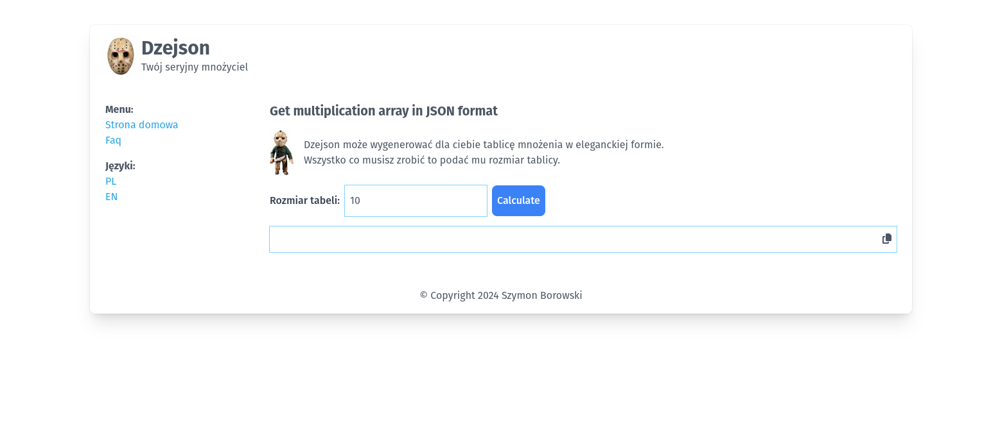

# Aplikacja Dzejson v.1.0.0

Aplikacja służy do generowania tabliczki mnożenia w formacie JSON.
Rozmiar tablicy musi mieścić się w zakresie od 1 do 1000.
Aplikacja jest gotowa do generowania tablicy w innych formatach.

Aplikacja została dostarczona z konfiguracją środowiska docker.

Aby zainstalować aplikację:
- zainstaluj zależności poleceniem `composer install`
- uruchom środowisko poleceniem `vendor/bin/sail up --build -d`
- uruchom migrację poleceniem `vendor/bin/sail artisan migrate`
- zainstaluj tailwind poleceniem `vendor/bin/sail npn install`
- przegeneruj zasoby poleceniem `vendor/bin/sail npn run dev`

Aplikacja będzie dostępna pod adresem lokalnym: http://localhost/

